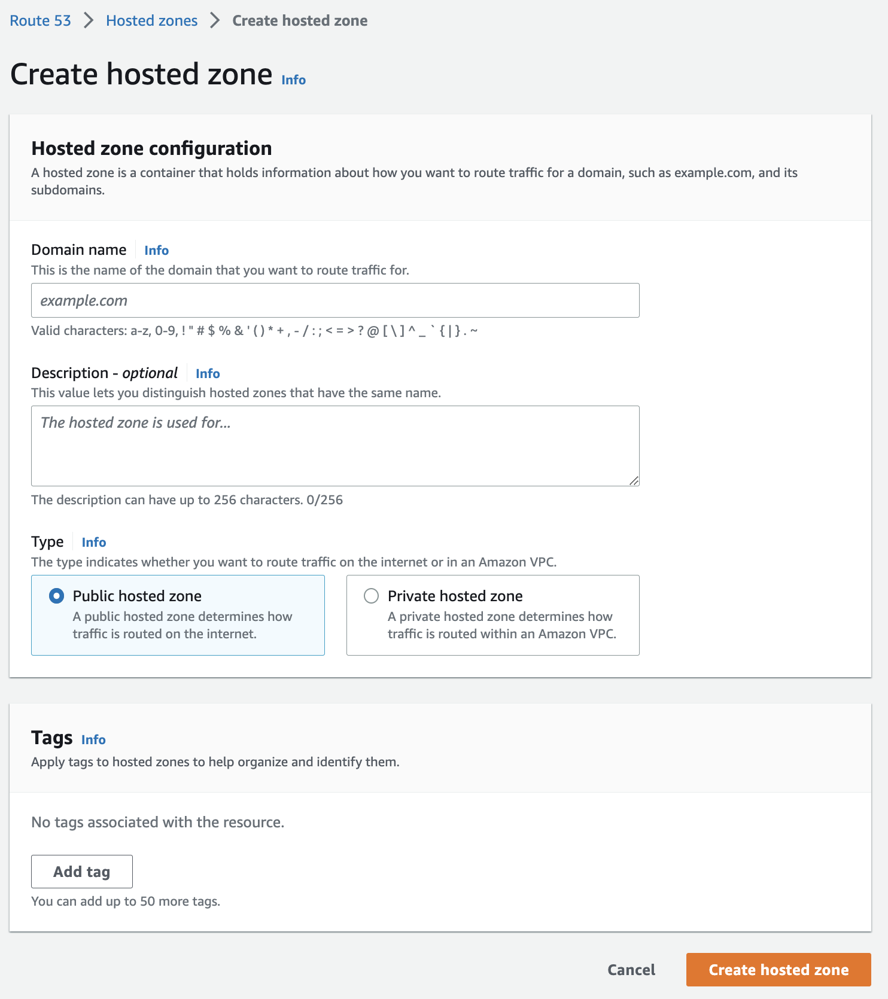
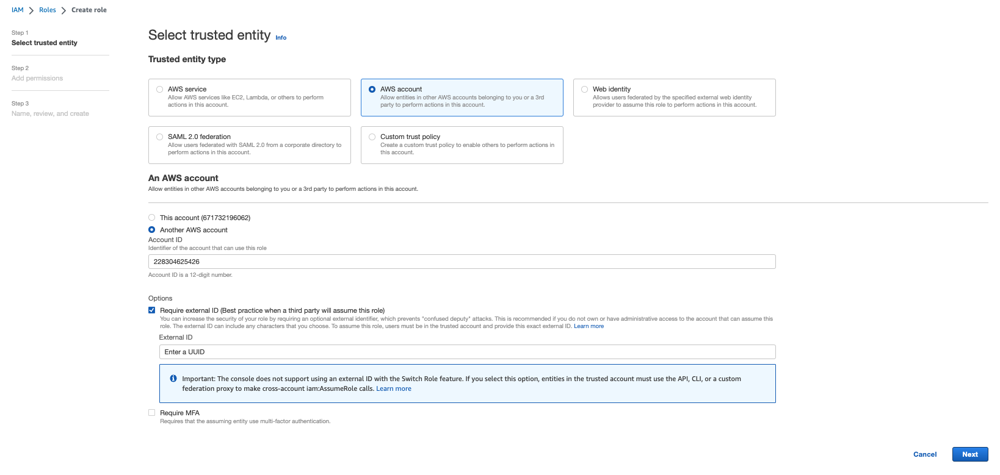
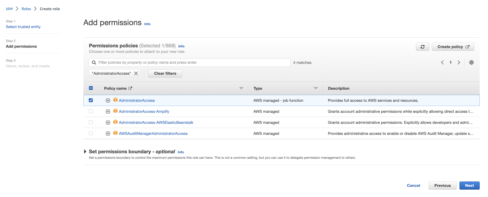

# Initial Instructions

Before you are off and running with Compoze, there are a few one-time set up items to take care of. This allows the Compoze platform all the access rqeuired to full leverage all that Compoze has to offer.

## Setup Steps

### Step 1. Register a Route 53 Domain

You will need to register a domain through AWS Route 53. This will be used by Compoze to provision DNS entries for services created through the product.

AWS detailed instructions can be found here: https://docs.aws.amazon.com/Route53/latest/DeveloperGuide/domain-register.html

### Step 2. Create a Compoze IAM Role

Next, you will need to create an IAM Role for the Compoze product inside your AWS account. This allows Compoze to provision all the required services.

In Step 1 of the IAM role creation, apply the following:
   1. The trusted entity type should be "AWS Account"
   2. The role should be for Another AWS account with Account ID: "228304625426"
   3. Select the checkbox "Require external ID" and provide a UUID value

   1. Next, search for and select policy "AdministratorAccess" to the apply to the role

)

   5. Finally, in step 3, name the role exactly as: "CompozeAutomationRole" and select create role

For detail instructions to create an IAM role, refer to: https://docs.aws.amazon.com/IAM/latest/UserGuide/id_roles_create.html.

### Step 3. Enable non root accounts to interact with billing information

This is done via the root account login.